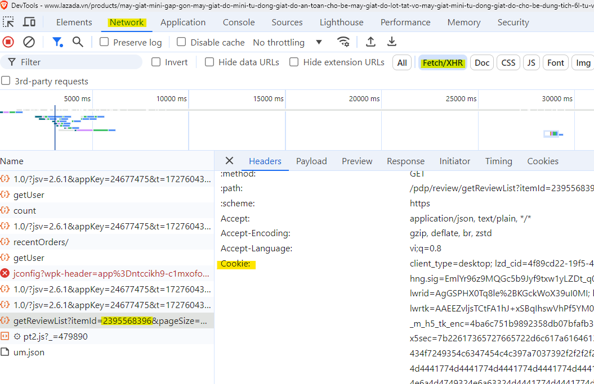

# Lazada Review Crawler
This project is designed to crawl product reviews from Lazada by interacting with the network requests from the product review section of a Lazada product page.

## Prerequisites
 - Node.js (v14 or later)
 - Docker (optional, if using Docker)

## Setup

### Step 1: Find a Product
1. Open Lazada and find a product.
2. Right-click on the page and select Inspect (or press F12).

### Step 2: Capture the Product Reviews Request
1. Go to the Network tab in your browser’s developer tools.
2. Click on the Fetch/XHR filter to only see API requests.
3. Scroll to a different page under the "Product Reviews" section on Lazada. You should see a new request appear. It will look similar to the image below.<br/>


## Step 3: Set Up Environment Variables
1. Find the `ItemId`, `Cookie` and `x-csrf-token` from the network request you captured.
2. Open the .env.example file and paste the values for ItemId and Cookie in the appropriate places.

## Step 4: Rename .env.example
Rename `.env.example` to `.env`.
```
mv .env.example .env
```

### Step 5: Install Dependencies
Run the following command to install project dependencies:
```
npm install
```

### Step 6: Run the Application
Once the dependencies are installed, you can start the application using:
```
npm start
```

## Running with Docker
### Step 1: Build the Docker image
```
docker build -t crawl-lazada-review .
```

### Step 2: Run the Docker container
```
docker run --env-file .env crawl-lazada-review
```

*Note: When you make changes to the .env file, you only need to repeat Step 2 to apply the updated environment variables.*
